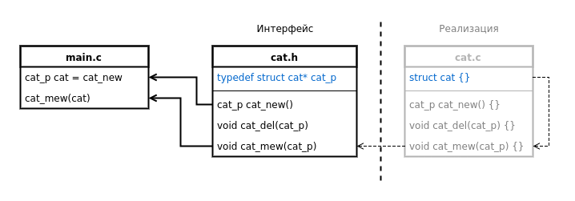

# cats c-patterns

## ADT

Abstract Data Type

Паттерн позволяет спрятать данные, разрешив доступ только через интерфейс

Конструктор возращает указатель на "незавершенную" структуру, посредством которого нельзя получить доступ к данным.

## STATE 

Finite State Machine

Конечный автомат, система с несколькими состояниями

