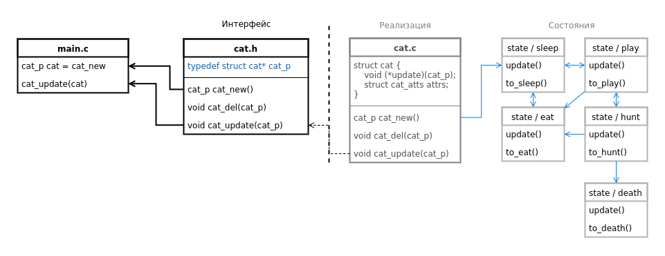

# cats c-patterns

## ADT

Abstract Data Type

Паттерн позволяет спрятать данные, разрешив доступ только через интерфейс

Конструктор возращает указатель на "незавершенную" структуру, посредством которого нельзя получить доступ к данным.

## STATE 

Finite State Machine

Конечный автомат, система с несколькими состояниями

Для функционирования кота-автомата достаточно одного метода update, осуществляющего один логический шаг в графе состояний. Во время этого шага происходит изменение динамических параметров кота - энергия, голод, запасы еды, а также переход в новое состояние.

При этом структура состояния также анонимна, содержащая только абстракный интерфейс обновления. 
